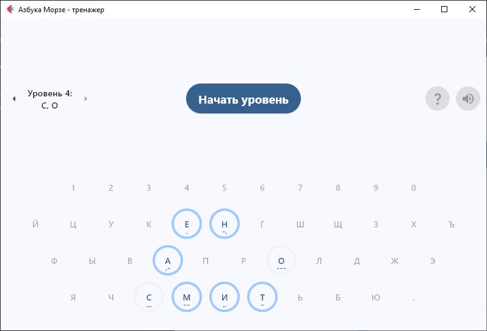
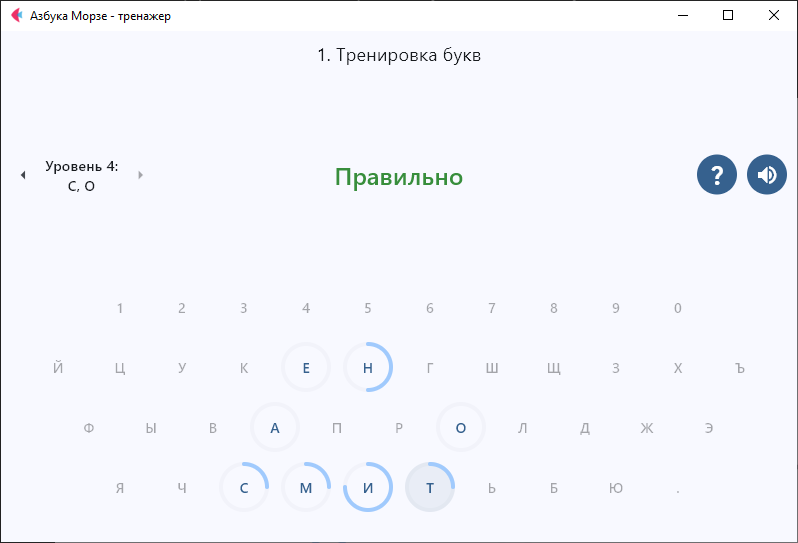
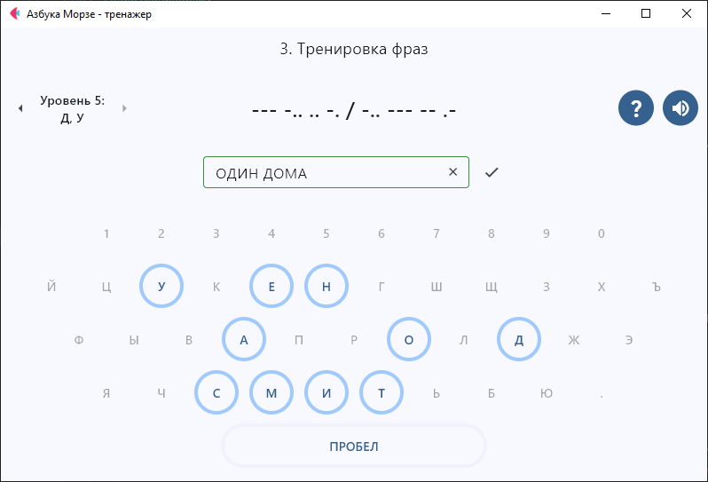

# Тренажер Азбуки Морзе

Создан базовый рабочий функционал (пока только для Windows)

Для остальных платформ надо минимально доработать звук и дизайн (адаптивку)

Собранный exe файл для Windows 10, 11 64 bit - Releases / "Азбука Морзе.exe"  
Прогресс сохраняется в файле *morse_progress.json* в директории, откуда запускается exe файл

Пока нет готовой иструкции, понять, как работает тренажер - тоже своеобразный тест на логику.  
Надо слушать звук и угадывать, какой букве этот звук соответствует. Длинный звук - тире, короткий - точка.  
Для помощи есть кнопки подсказка (можно нажать два раза) и повторить звук.  







## Для разработки

Запустить приложение - [Running a Flet app](https://docs.flet.dev/getting-started/running-app/)

Документация по Flet - [Getting Started Guide](https://docs.flet.dev/).

#### Собрать exe файл для Windows с помощью PyInstaller

```
pyinstaller --icon=src\assets\icon.ico src\main.py -n morse_trainer  --noconsole --noconfirm --onefile  --clean --add-data "src\sound\beep_dot.wav:sound" --add-data "src\sound\beep_dash.wav:sound"
```

Прогресс сохраняется в файле *morse_progress.json* в директории, откуда запускается exe файл

https://pyinstaller.org/en/stable/usage.html


## Build the app

### Android

```
flet build apk -v
```

For more details on building and signing `.apk` or `.aab`, refer to the [Android Packaging Guide](https://docs.flet.dev/publish/android/).

### iOS

```
flet build ipa -v
```

For more details on building and signing `.ipa`, refer to the [iOS Packaging Guide](https://docs.flet.dev/publish/ios/).

### macOS

```
flet build macos -v
```

For more details on building macOS package, refer to the [macOS Packaging Guide](https://docs.flet.dev/publish/macos/).

### Linux

```
flet build linux -v
```

For more details on building Linux package, refer to the [Linux Packaging Guide](https://docs.flet.dev/publish/linux/).

### Windows

```
flet build windows -v
```

For more details on building Windows package, refer to the [Windows Packaging Guide](https://docs.flet.dev/publish/windows/).